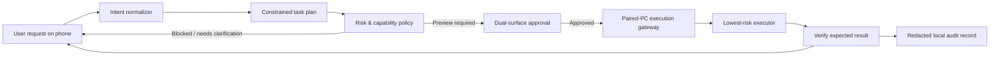

# Butler AI — Permissioned PC Automation Research and Architecture

**Author:** Manus AI  
**Purpose:** Define an original, privacy-first foundation for turning a user’s natural-language request into a clear, approved, and auditable task on their paired computer. This is an architectural study, not copied third-party code.

## Research Findings

The strongest comparable systems do not treat natural-language automation as a direct path from prompt to unrestricted operating-system control. Open Interpreter separates sandbox capability from approval policy; that distinction maps well to Butler’s existing paired-PC boundary because the system can decide what is technically possible without deciding that it is automatically permitted.[1]

Microsoft’s desktop automation guidance reinforces a second important boundary: **attended** and **unattended** automation have different operational and credential consequences. Unattended runs create and manage a Windows session, require dedicated permissioning, and are constrained by active-session conditions. Butler should therefore begin with attended, foreground-visible operation instead of introducing hidden scheduling or background control.[2]

For interaction reliability, Windows UI Automation exposes programmatic information about desktop UI elements. pywinauto demonstrates how a later Windows executor can prefer application/process boundaries and stable UIA selectors such as title, automation ID, and control type. Coordinate-level input should be a constrained fallback only when semantic selectors are unavailable.[3] [4]

PyAutoGUI is useful as a safety-pattern reference, not as a universal first choice. Its documentation includes a global pause and a user-controllable fail-safe exception, which Butler should treat as mandatory features whenever mouse or keyboard emulation is introduced.[5]

For Python task execution, the standard library recommends `subprocess.run()` for ordinary invocations, argument sequences rather than shell strings, explicit timeouts, and `shell=False` by default. The `ast` module provides a parser for inspecting generated source before it is ever offered for execution, but syntax inspection is not a security sandbox and must be combined with capability policy and user approval.[6] [7]

| Studied approach | Useful idea for Butler | What Butler must not copy or assume |
|---|---|---|
| **Open Interpreter** | Separate capability sandbox from approval decisions. | An approval model alone is not sufficient without per-action scope, pairing proof, and audit records. |
| **Power Automate Desktop** | Treat foreground-attended and unattended work as distinct operating modes. | Butler should not start with unattended sessions, credential storage, or hidden scheduled execution. |
| **Windows UI Automation / pywinauto** | Prefer semantic UI selectors and process/window scope to raw coordinates. | UI metadata can be missing or change; every selector needs verification and a clear failure state. |
| **PyAutoGUI** | Keep an obvious human interrupt and paced interaction. | Mouse/keyboard emulation is fragile and must never be the silent default for consequential actions. |
| **Python `subprocess` / `ast`** | Validate plans, parse scripts, pass argument arrays, use explicit timeouts. | AST checks cannot prove a script is harmless; arbitrary code cannot bypass the approval and capability gates. |

## Product Boundary

> **Butler should automate only actions that the user can see, understand, authorize, stop, and review on a PC they own or are authorized to control.**

The app must not claim that it can “do anything” automatically. A truthful promise is stronger: a user can ask in plain language; Butler turns the request into a visible plan, selects the lowest-risk approved method, shows what will change, requests confirmation when needed, and records the result locally. Tasks involving credentials, payments, deletion, elevated privileges, security controls, communications to third parties, or irreversible data changes must require a fresh, explicit confirmation at the PC and the phone.

## Original Butler Task Architecture

The **Intent Normalizer** transforms natural language into a constrained plan, not raw shell text. Each plan must identify its goal, requested capability, target application or user-selected folder, reversible actions, expected visible result, time limit, and proposed verification. It can use a local PC model when configured, but model output is merely a draft until policy validation and user authorization finish.

The **Risk and Capability Policy** is the product’s authority. It assigns every requested step one of four outcomes: automatically eligible only for non-destructive, pre-approved local recipes; preview-and-approve for ordinary file/UI/process work; PC-and-phone confirmation for consequential actions; and blocked for actions outside the product boundary. It must reject hidden persistence, credential extraction, security bypass, data exfiltration, unauthorized remote control, and attempts to self-expand its capability set.

The **Dual-Surface Approval** screen must show a human-readable summary before work begins: apps and files in scope, command or UI action sequence, irreversible actions, elevated-permission requirement, network use, and a plain-language “why.” The phone confirms the user’s intent; the PC confirms that the local machine user is present. Neither confirmation is reusable for a broader task. A plan expires if it is not executed promptly or if its target window/file scope changes.

The **Paired-PC Execution Gateway** continues to use the established per-install pairing identity, encrypted local token storage, bounded request timeouts, and reconnection de-duplication. It accepts only a signed, schema-validated plan from the paired phone. It does not accept arbitrary shell strings, Python source, or executable paths directly from a natural-language field.

The **Executor Ladder** chooses the least powerful method that can complete a plan. First are Butler-owned deterministic recipes with explicit inputs. Second are application-scoped Windows UI Automation selectors. Third are paused, fail-safe mouse/keyboard sequences visible to the user. Fourth are generated Python scripts only after parsing, static policy checks, a human-readable diff, explicit approval, a working-directory allowlist, a runtime deadline, limited environment, captured bounded output, and a no-shell process invocation. The system must verify the expected result after every executor stage and stop rather than guessing when verification fails.

The **Audit Layer** records plan ID, capability category, consent IDs, executor type, timing, outcome, and a redacted summary. It does not store raw tokens, private local paths beyond the user-approved scope, clipboard contents, screenshots, or full command output by default. A user-facing timeline exposes “what happened” and supports removal of local history.

## Capability Classes

| Class | Examples | Authorization | Default execution rule |
|---|---|---|---|
| **Read-only** | Inspect running app, summarize a user-selected folder, view CPU state. | One on-screen preview approval. | Execute within a fixed time and return a bounded result. |
| **Reversible local change** | Rename selected files, draft text in an open editor, adjust a non-security app preference. | Fresh phone approval and visible PC confirmation. | Create preview/dry run where possible; stop on target mismatch. |
| **Consequential change** | Delete files, install software, change startup items, send messages, alter account/security settings. | Explicit dual confirmation for each operation. | Disabled until a dedicated capability implementation and verification flow exist. |
| **Forbidden** | Credential theft, privilege escalation, security bypass, evading monitoring, copying private data without disclosure. | Never. | Block and create no execution request. |

## Implementation Choices

The following routes are viable. They have different product and implementation implications, so no route should be selected silently.

| Approach | Tradeoffs | Cost | Setup complexity |
|---|---|---:|---:|
| **Visible task recipes first** | Supports reliable everyday tasks quickly, but initially covers a curated set rather than every application. | No required cloud cost. | Lowest; extends the existing paired-PC server with a signed recipe catalog and approval UX. |
| **Attended desktop action planner** | Lets the user describe more tasks, but needs robust UI selector capture, verification, and careful error handling across applications. | No required cloud cost when using a local PC model. | Medium; requires a Windows executor module and the full plan/approval/audit contract. |
| **Later, managed unattended automation** | Useful for repetitive, scheduled tasks, but adds credential, active-session, privilege, recovery, and security responsibilities. | Potential ongoing infrastructure or licensing cost. | High; deliberately out of the initial release scope. |

## Phased Roadmap

| Phase | Deliverable | Safety gate | Definition of done |
|---|---|---|---|
| **A — Task Composer** | A Butler screen that accepts a request and renders a plan preview without executing. | No executor endpoint exists yet. | Every plan has scope, risk category, verification condition, and cancel state. |
| **B — Recipe Catalog** | Deterministic, app-owned actions such as open a selected local app, collect system information, or organize files inside a user-selected folder. | Explicit per-recipe approval and no elevated privileges. | Each recipe has tests, bounded inputs, a dry-run or preview where appropriate, and an audit entry. |
| **C — Attended UI Automation** | Windows UIA selector capture and a visible foreground executor. | Window/process allowlist, fail-safe stop, selector verification before every action. | The executor stops safely when the expected target changes or disappears. |
| **D — Script Proposal Lab** | Generated Python appears as a reviewable proposal, AST policy findings, and a sandboxed dry run. | Never execute source directly from the prompt; dual approval remains mandatory. | `shell=False`, argument arrays, timeouts, workdir allowlist, bounded logs, and static danger labels are enforced. |
| **E — Optional expanded automation** | Only after device testing and abuse review, consider more application connectors or scheduled workflows. | Separate user setting, transparent schedule screen, per-run logs, and revoke controls. | The user can inspect, pause, revoke, and delete every saved automation. |

## Required User Decisions Before Building the Executor

The foundation work can proceed independently, but the live executor needs the user to choose a first product boundary. The appropriate choices are whether the initial release should focus on **a curated set of safe task recipes** or **a broader attended planner that controls only visible, user-approved Windows applications**; whether the paired PC will be **Windows-only for the first release**; and whether the PC should use **a local model only** or also permit a clearly disclosed optional external model provider. These decisions materially change both the server design and the privacy disclosure.

## References

[1] [Open Interpreter — Terminal Documentation](https://www.openinterpreter.com/docs/terminal)

[2] [Microsoft Learn — Run unattended desktop flows](https://learn.microsoft.com/en-us/power-automate/desktop-flows/run-unattended-desktop-flows)

[3] [Microsoft Learn — UI Automation](https://learn.microsoft.com/en-us/windows/win32/winauto/entry-uiauto-win32)

[4] [pywinauto — Getting Started Guide](https://pywinauto.readthedocs.io/en/latest/getting_started.html)

[5] [PyAutoGUI — Cheat Sheet and Fail-Safes](https://pyautogui.readthedocs.io/en/latest/quickstart.html)

[6] [Python Documentation — `subprocess`](https://docs.python.org/3/library/subprocess.html)

[7] [Python Documentation — `ast`](https://docs.python.org/3/library/ast.html)
