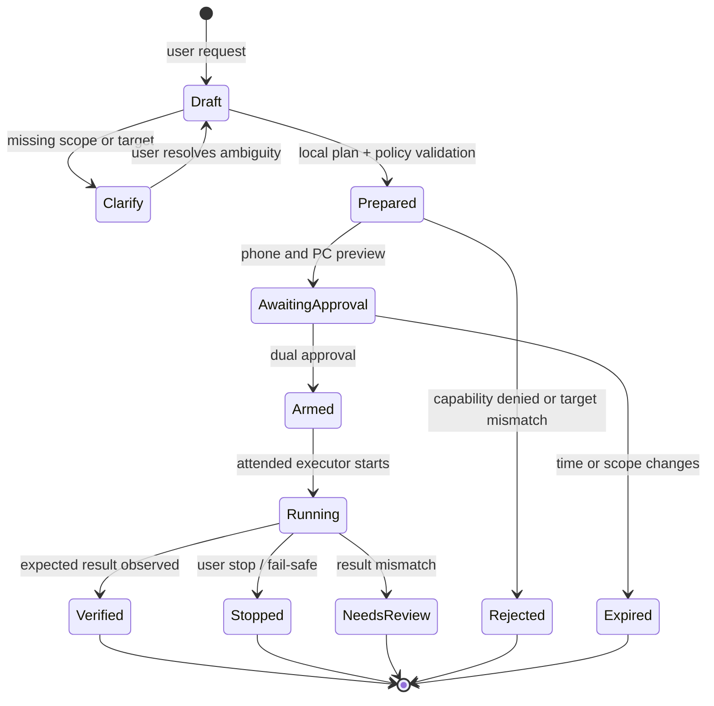

# Butler AI — Self-Hosted Executor Contract

## Purpose

This document defines **Task Pact**, the original Butler contract for turning a plain-language request into an attended, user-authorized operation on a paired computer. A Task Pact is a structured agreement between the phone, the paired PC, and the user—not an arbitrary command string.

The contract is designed for an offline-first Butler deployment. It preserves the existing paired-PC authentication boundary and deliberately avoids silent cloud dependencies, hidden schedules, unbounded script execution, or token-less connections.

## Terminology

| Term | Meaning |
|---|---|
| **Local PC model** | An optional AI model running on the paired computer itself, for example through a locally installed inference service. It can help draft task plans but has no direct execution authority. No user prompt needs to leave the PC for planning. |
| **Task Pact** | A schema-validated, time-limited plan that lists scope, expected result, capabilities, risk, approval requirements, and verification before execution. |
| **Capability** | A narrow permission such as reading system metrics or modifying only a user-selected folder. It is not a blanket “PC access” switch. |
| **Attended operation** | A user can see the PC action and can stop it. This is Butler’s initial automation mode. |
| **Executor** | A constrained PC-side action method selected only after a Task Pact is approved. |

## Task Pact Lifecycle



The plan is rejected if it cannot identify a target scope, requires an ungranted capability, asks to bypass safeguards, or attempts to use raw code as an execution request. A Task Pact expires before execution if the user waits too long or if its target application/window/folder does not match the prepared plan.

## Original Plan Shape

The protocol should transport data equivalent to the following conceptual shape. It is intentionally not executable source code.

```text
TaskPact
  pactId: random identifier
  revision: integer
  createdAt / expiresAt: UTC timestamps
  summary: plain-language user goal
  scope: app process, window selector, or user-approved folder boundary
  capabilities: narrow allowlisted operations
  risk: read_only | reversible | consequential | blocked
  steps: observable actions plus expected check after each step
  proposedExecutor: recipe | ui_automation | script_proposal
  confirmation: phone + local-PC presence required where applicable
  verification: expected state / output boundary
  privacy: network use, data classes, and retention statement
  pactHash: digest of the approved canonical plan
```

The PC is authoritative for plan validation. The phone may propose or display a plan, but it cannot reduce the risk category, enlarge scope, modify a plan after approval, or activate an executor by sending an arbitrary shell command.

## Capability and Approval Matrix

| Capability | Example | Approval rule | Initial support |
|---|---|---|---|
| `system.read` | Read CPU, RAM, disk, or current Butler health. | Phone preview. | Eligible first. |
| `files.list` | Inspect a user-selected directory. | Phone preview; path must be inside selected scope. | Eligible first. |
| `files.organize` | Rename or move items within a selected folder. | Phone and PC approval; dry run first. | Eligible after recipe tests. |
| `app.launch` | Launch an allowed local application. | Phone and PC approval. | Eligible after allowlist UI. |
| `ui.attended` | Click a verified control in the foreground target window. | Phone and PC approval; visible stop control. | Later phase. |
| `script.proposal` | Show generated Python for review without running it. | Phone preview. | Later phase. |
| `script.execute` | Run a reviewed, constrained script. | Fresh dual approval; only after sandbox and static policy implementation. | Not initially enabled. |
| `system.power` | Restart, sleep, or shut down a PC. | Fresh dual approval with countdown and cancellation. | Not initially enabled. |
| `clipboard.read` / `clipboard.write` | Read or replace clipboard contents. | Fresh dual approval and clear privacy disclosure. | Not initially enabled. |

## Executor Ladder

The PC always chooses the least powerful executor able to fulfil an approved Task Pact. This reduces both reliability problems and the amount of authority granted to a task.

| Order | Executor | Rules |
|---:|---|---|
| 1 | **Butler recipe** | Authored specifically for Butler with bounded inputs and an expected result. Preferred initial path. |
| 2 | **Semantic UI action** | Targets a verified application and UI control selector. Re-check target ownership before every action. |
| 3 | **Visible input fallback** | Uses paced, fail-safe mouse/keyboard input only in the foreground. A user stop/fail-safe must interrupt immediately. |
| 4 | **Script proposal** | May be drafted locally and inspected, but is never an execution payload by default. |
| 5 | **Constrained script execution** | Future-only: static policy, allowlisted working directory, no shell strings, timeout, bounded output, and fresh dual approval. |

The automation literature distinguishes semantic desktop UI controls from raw coordinate control, while PyAutoGUI documents a user-controllable fail-safe mechanism; both support the priority given to verifiable selectors and visible interruption.[1] [2]

## Minimal Paired-PC API

The following endpoints are a design contract for an **original future Butler server module**. They are not copied from the uploaded server material and must not be added until the server implementation has its own validation suite.

| Endpoint | Purpose | Authentication and safety |
|---|---|---|
| `POST /api/task/prepare` | Convert a request into a Task Pact preview. | Existing paired token; no execution. |
| `POST /api/task/approve` | Bind phone approval to the immutable pact hash. | Existing paired token; short expiry; cannot expand scope. |
| `POST /api/task/arm` | Record visible local-PC approval. | Local PC presence; fresh confirmation for consequential tasks. |
| `POST /api/task/run` | Start a fully approved pact. | Requires both approvals and active attended state. |
| `POST /api/task/stop` | Stop the active pact. | Always available to the paired user; logs a redacted stop reason. |
| `GET /api/task/:id` | Return bounded progress and result metadata. | Existing paired token; no raw secrets/output by default. |

No `/api/execute` endpoint accepting arbitrary Python, PowerShell, Bash, or CMD text belongs in this contract. Python’s standard documentation recommends explicit argument sequences, `shell=False`, and timeouts for process creation; those standards apply only to a later constrained executor, not to a raw remote-code endpoint.[3]

## Guardrails That Remain Non-Negotiable

The initial Butler server must remain **attended-only**. It must not auto-install packages, open network tunnels, launch background schedules, retain clipboard history, or send prompts/telemetry outside the paired PC unless the user knowingly enables a future separately disclosed feature. A local model can help with task planning, but the policy engine—not the model—decides what may run.

The implementation must reuse the existing encrypted storage, app-install pairing identity, session-token requirement, bounded request timeout, foreground guard, reduced-motion preference, and local diagnostic redaction. The paired connection cannot fall back to an open server or a token-less response.

## Staged Integration Plan

| Stage | Original Butler deliverable | Completion condition |
|---|---|---|
| **1. Pact Preview** | A mobile task composer that turns a request into a non-executing Task Pact preview. | The user can inspect scope, risk, privacy, and expected result; cancel always works. |
| **2. Safe Recipes** | A small server-owned recipe registry for read-only and selected-folder operations. | Every recipe has bounded inputs, a testable expected result, and a redacted audit event. |
| **3. Approval Console** | A PC-side visible confirmation window paired to the pact hash. | Consequential tasks cannot run with only phone approval. |
| **4. Attended UI Actions** | Verified foreground UI Automation with a stop/fail-safe control. | Target revalidation stops execution on mismatch. |
| **5. Script Proposal Lab** | Local-model or rule-based Python proposal review, static policy findings, and a dry-run experience. | No generated source is run as raw remote input. |

## References

[1] [Microsoft Learn — UI Automation](https://learn.microsoft.com/en-us/windows/win32/winauto/entry-uiauto-win32)

[2] [PyAutoGUI — Cheat Sheet and Fail-Safes](https://pyautogui.readthedocs.io/en/latest/quickstart.html)

[3] [Python Documentation — `subprocess`](https://docs.python.org/3/library/subprocess.html)
